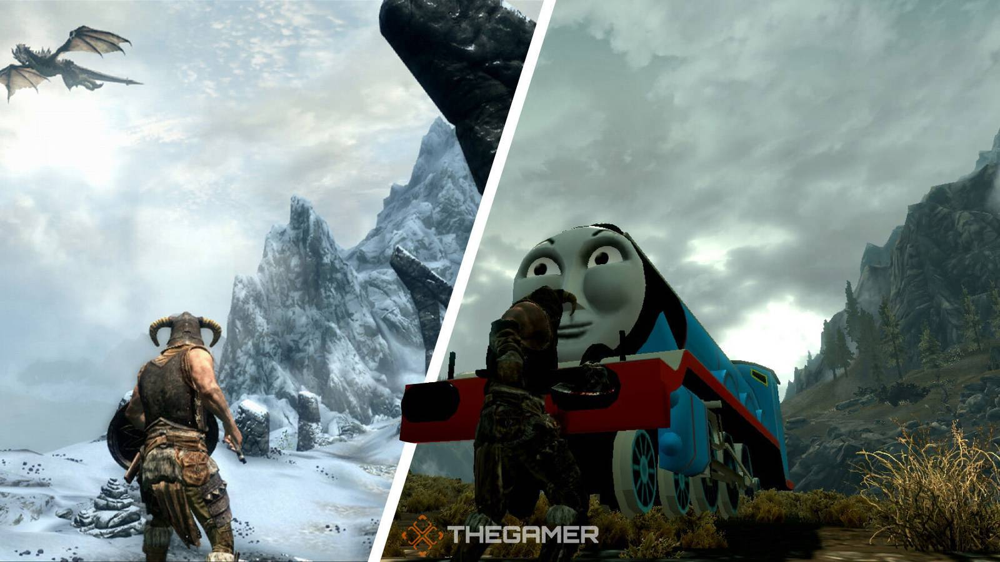

# Why Modding?

### Early Interests

Modding is something I've always wanted to get involved with ever since I learned how to program.
In fact, one of my earliest programming memories centers around my 14-year-old self spending late
nights hacking away at rudimentary custom minecraft mods; poking and prodding at various java files to 
see what would happen if I changed a value here or added a custom function there. I didn't think much of it at the time, but this was experienced ultimately served as my introduction to modding (and open-source software in general).

Fast forward to university, when my roommate finally got me to play Skyrim after insisting for months. I knew I was late to the party, but I didn't quite realize just how epic this party really was. After diving deep into the land of Tamriel for hours upon hours, I had finally completed Skyrim. Or so I thought. You see, this particular game is famous for its modding commmunity- as of writing this there's over 100,000 different open-source mods written by various programmers. This blew my mind! Learning that custom side quests, enemies, spells, and weapons were only the tip of the iceberg that was "Skyrim with mods" really opened my eyes to the power of modding, and this ultimately solidified my interest in the scene.

*Yes, there's a mod that replaces the dragons with trains from Thomas the Tank Engine.*

...

The rest of this post is still in progress!