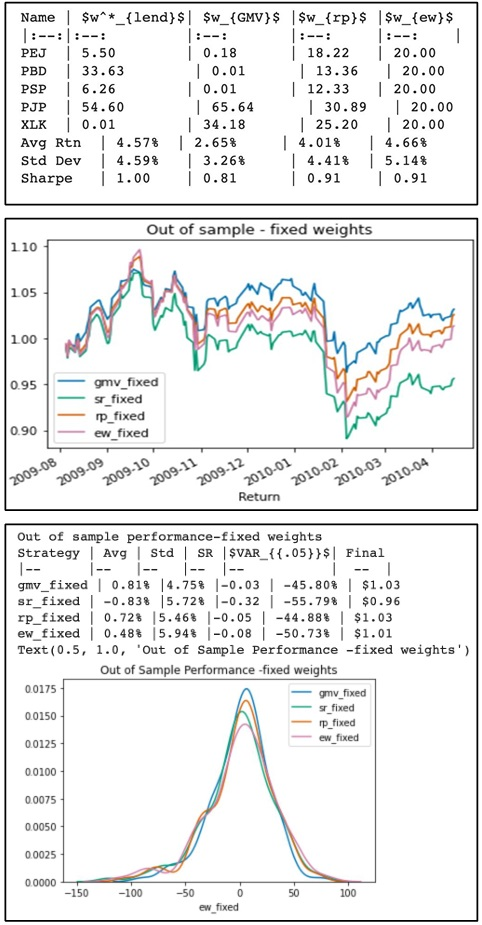
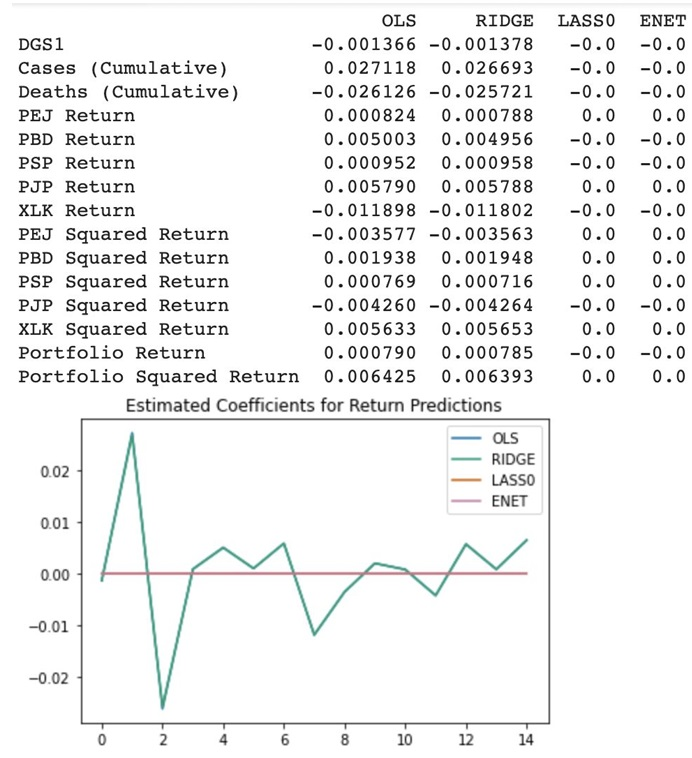

### Trapped in a hot stuffy room in the Summer of 2020...

I was given the opportunity to enroll in an experimental course being piloted by my undergraduate program, titled: "Machine Learning and Data for Finance". It was a generous effort by the university to make up for the sudden influx of cancelled in-person summer courses and internships. The course focused on both portfolio and machine learning strategies, and it led me to my simple but ambitious final project: could data from the 2009-2010 H1N1 (Swine Flu) pandemic be used to predict how financial markets might behave during COVID-19?. Here is a look at my findings.

## Methodology

In order to see how five specific US sectors performed when a pandemic hits the economy, I tracked five different ETFs:

    ● PEJ - Invesco Dynamic Leisure and Entertainment ETF
    ● PBD - Invesco Global Clean Energy ETF
    ● PSP - Invesco Global Listed Private Equity ETF
    ● PJP - Invesco Dynamic Pharmaceuticals ETF
    ● XLK - Technology Select Sector SPDR Fund

I then used the assets' daily prices during the Swine Flu pandemic (obtained from Yahoo! Finance) in tandem with US H1N1 ("Swine Flu") data sourced from the CDC and WHO. Additionally, in order to get the historical risk-free rate required I leaned on public Federal Reserve data.

Then, I tested a few different weighing strategies on this portfolio to see which would hold up best under pressure. These were my results:

#### Winners
It was a tie between the Global Minimum Variance (GMV) and Risk Parity (RP) portfolios. These strategies focus on minimizing overall risk and volatility, which proved to be the most stable approach during market swings.

#### Surprise
An Equal Weights portfolio (just putting 20% into everything) actually performed quite well and wasn't far behind the winners.

#### Loser
The Sharpe Ratio portfolio, which usually tries to maximize "bang for your buck," actually performed the worst in this scenario.

The following generated charts led us to these findings:

On the machine learning front, we compared several regression methods—OLS, Ridge, LASSO, and Elastic Net (ENET)—to see which could best predict returns.

Ridge Regression came out on top for our specific model. However, this project taught me a huge lesson about the limitations of data. Even though Ridge was the "best" performer, it didn't quite meet our expectations.

Why? Because the training set for the H1N1 pandemic was relatively small, making it very easy for a model to overfit. It was a great reminder that even the best math can't fully predict the "black swan" nature of a global pandemic.

## Final Takeaways

If you find yourself investing during a global health crisis, our model suggests two clear priorities: Pharmaceuticals and Technology. On the flip side, we found that Leisure, Entertainment, and Private Equity were much riskier bets during those high-volatility windows.

Looking back, this project (and course) was a much-needed relief for me during the rough COVID-19 summer. I definitely learned a lot within both the financial and technical realms, which I am also certain nudged me toward the direction of my current career. If I find myself with some more free time, I’d love to pull in more macroeconomic variables like GDP and unemployment rates to see how they change the model’s accuracy. Anyways, thanks for reading this and feel free to check out the code powering this project in this [github repo](https://github.com/jdm-v/pandemic_portfolio) I made.

