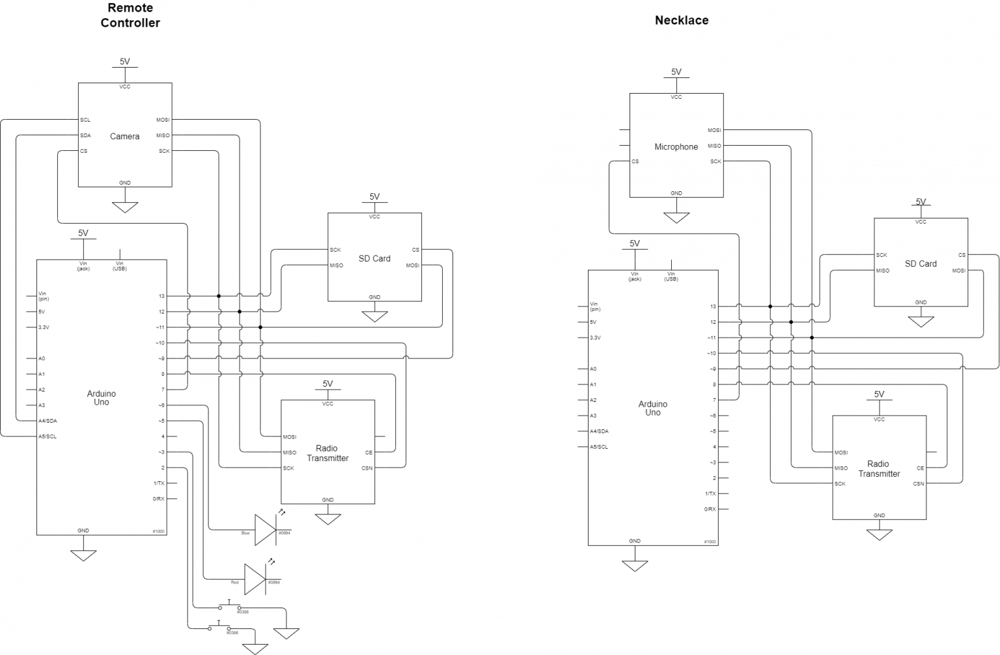
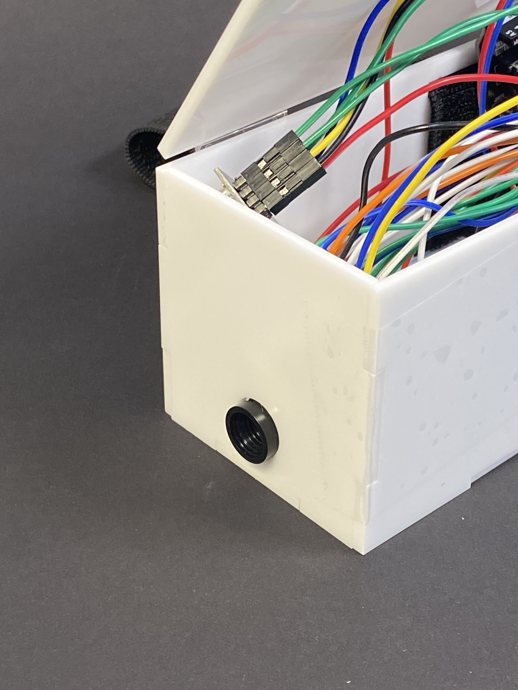
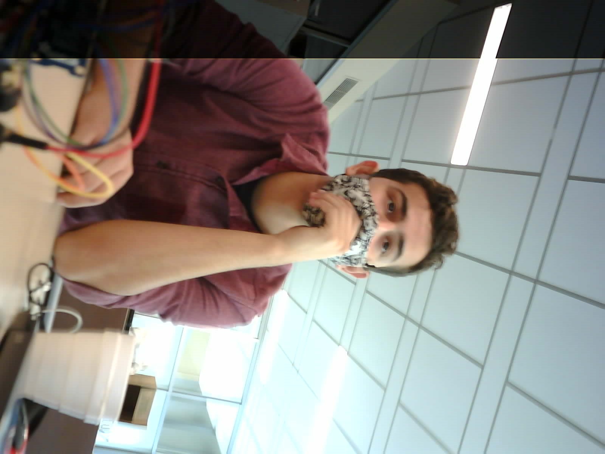
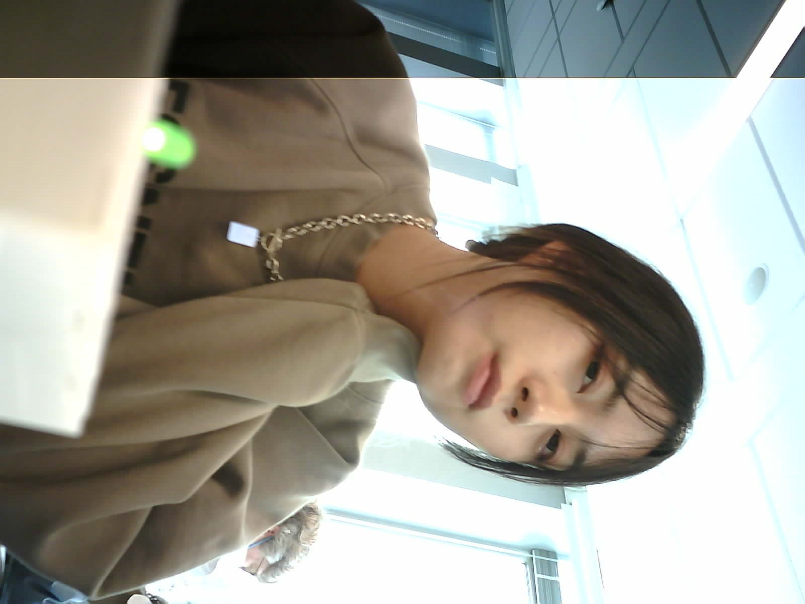

### Introducing the 'Inspiration Capture Device'

One of the last courses I took at Carnegie Mellon was 'Intro to Physical Computing', which just so happened to end up being one of my favorite courses I ever had the pleasure of taking! This course focused on, you guessed it, physical computing by leveraging Arduino to make all sorts of fun and wacky things! Prior to this, I had never written code to control anything physical (though thankfully I already had exposure to C) so there were a lot of things to learn about Arduino and hardware in general. There was also, however, quite a bit of learning of basic electrical principles mainly for safety and design purposes. Using this basic knowledge, we were able to create circuit diagrams after only a couple of weeks in the course, and eventually that evolved into more complex diagrams for our final project, like the ones you see here:
 
 

Without a doubt my favorite part of this course was its final project, which was to create an assistive device for somebody living with a disability. What really elevated this project was how the professor, the dedicated [Robert Zaccharias](https://ideate.cmu.edu/about/people/participating-educators/robert-zacharias.html), reached out to real people within the Pittsburgh community living with different physical challenges to be our "clients". Thus, every group was required to set up meetings with their client to gather releveant requirements and feedback for their device! This was a super cool aspect of the project that I wish more courses replicated, as I really do think the payoff is worth the effort. Having a real "client" that's looking forward to your device definitely provided me with extra motivation which was useful during late night debugging sessions at the Physical Computing lab underneath Hunt Library.

I encourage you to check out my team's post on the course's page containing much more in-depth details about my final project itself, including various schematics and media showcasing how the ICD works. You'll see just how we were able to work with Mary to create a device that helped her capture inspiration at any time given moment. The post can be found [here](https://courses.ideate.cmu.edu/60-223/s2022/work/index.html%3Fp=15849.html), and below I'll include some unused images/assets just to add more color. There were a few things I wish we had more time/resources to do, mainly regarding the form factor of the device, but who knows... maybe I'll make a second version with more modern (and more importantly, smaller) parts!

Special thanks to Professor Zaccharias, Team Callisto, and Mary for making this happen.
 
 

 
 

 
 

 
 

 
 
 