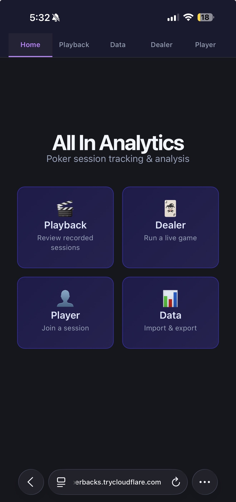
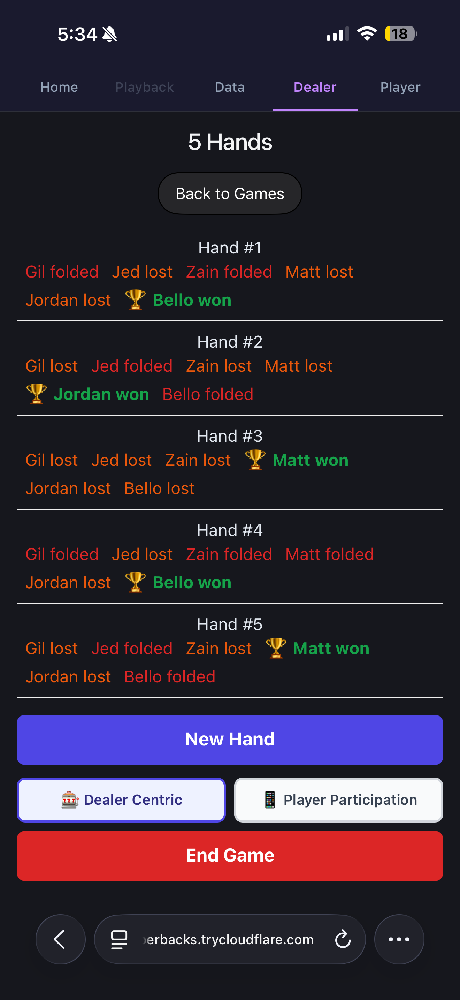
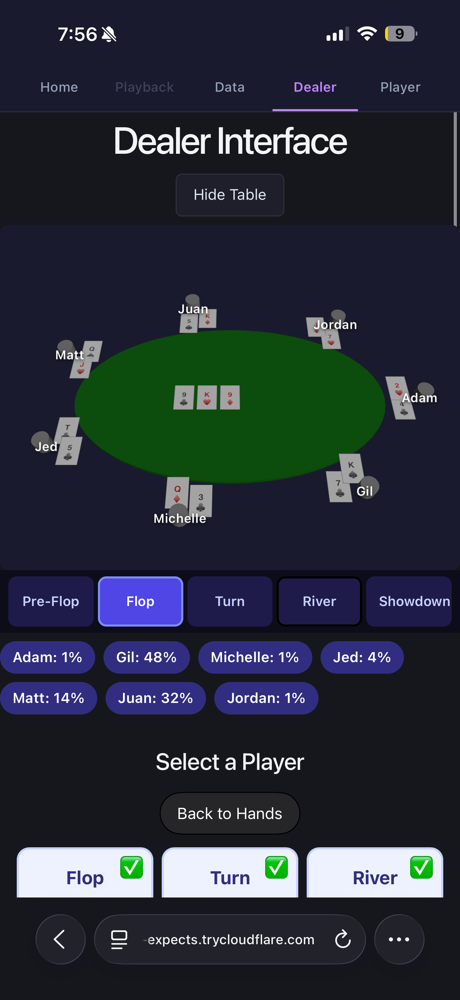

### What is All-In-Analytics (AIA)?

For about the past year or so, I've had the pleasure of participating in my good friend Adam's monthly poker nights. The games are low-stakes ($25 buy-in) and involve around 8 players and a dedicated dealer. The goal of these games is really to just have fun and relax, while helping interested players improve their poker skill. Now for context, both myself and Adam have been programming professionally for multiple years now, and so it wasn't long until we began conceptualizing a system to speed up the game and enable data analysis. Recently, we finally tested out an alpha version of the system, dubbed "All in Analytics", at a real game which was well-received (and reviewed). Before we begin iterating on the many points of feedback we got that night, I figured now was a good time to discuss the All-In-Analytics project and include it in my Dev Diary.

This project was actually started many months ago but scheduling issues made it difficult to consistently develop features in a timely manner. After all, everyone working on the project is working full-time, and considering other personal obligations made our timelines a bit longer than we'd prefer. Such long timelines would at times hurt motivation to continue, as features seemed to drag on and on. After a lull in development lasting a few months, a new tool appeared that essentially put the project in full throttle: Claude Opus 4.5. 

Personally, I had already been leveraging popular AI tools for development for a bit over a year now at work. My employer, like many other large firms, had been pushing for mass-adoption of coding assistants and internal LLMs slowly but surely. That being said, there were limits to the tools at our disposal, mainly due to the sensitive and regulatory nature of our work. We couldn't be too liberal with the latest in agentic coding techniques just yet, for instance, and I was itching to give it a go to see what all the hype was about. Thankfully, Adam was more familiar with this as his firm was on the bleeding edge of this frontier (the benefits of working at a medical AI company), and so he was able to catch me up to speed with ease. It was decided that we would replicate the "Gas Town" agentic-ai workflow structure (more info found [here](https://steve-yegge.medium.com/welcome-to-gas-town-4f25ee16dd04)) to overhaul and complete the All-In-Analytics project, which seemed to me like an evolved, more structured version of "vibe-coding". This decision to turn to coding agents not only increased our interest in the project, as we had both never "vibe-coded" a personal project before, but it sped up development to a degree that we couldn't imagine.

Anyways, the following assets come from our "alpha" version the webapp. There are quite a few things we're currently changing (such as leveraging React + Typescript instead of Preact), but this should give you an idea of the current state of All-In-Analytics. These are all screengrabs from the mobile version, as that is how we had the players interact with the platform. They show some of the main features of the webapp including card detection, game playback, and more. To start off, here's what the landing page looks like:
 
 

 
 
As you could see, we currently have both "Dealer" and "Player" modes. Naturally, the dealer has access to more information such as who is playing and who is folding/winning the hand. That looks like the following:

 
 

 
 
The player is pretty much only responsible for inputting their cards and updating their game status (e.g. if they fold early). We've implemented card detection to do the former:

 
 
Of course, AIA isn't just a tool to be used during the course of the game. After a game is over, you can export/import data and use a visualizer to "playback" certain hands. This is what we'll be leveraging for our analysis.

 
 

 
 
Stay tuned for more updates on this post! You can also check out the repo directly [here](https://github.com/achung123/aia-core) .
 
 
 